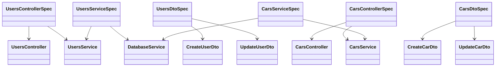
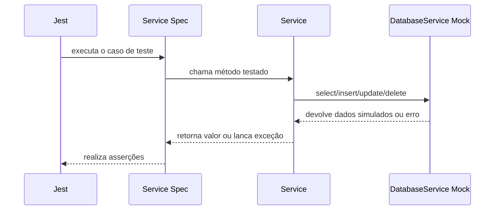

# Testes unitários com NestJS

Este projeto tem como objetivo principal demonstrar como estruturar e executar testes unitários em uma aplicação NestJS.

A aplicação usada como base é um CRUD simples de `users` e `cars`, mas o foco didático está em:

- testar `controllers` como unidade isolada;
- testar `services` sem banco real;
- testar validações e transformações de `DTOs`;
- usar mocks para isolar dependências;
- interpretar cobertura de testes com Jest.

## Objetivo de aprendizagem

Ao estudar este projeto, a ideia é praticar:

- organização de arquivos `*.spec.ts` no padrão do NestJS;
- uso de Jest como framework de testes;
- isolamento de dependências com mocks;
- validação de regras de negócio sem precisar subir PostgreSQL;
- testes de exceções como `NotFoundException` e `ConflictException`;
- testes de DTO com `class-validator` e `class-transformer`.

## Visão geral do cenário testado

O domínio funcional é pequeno de propósito, para permitir foco nos testes.

### Entidades

- `users`: usuários do sistema.
- `cars`: carros vinculados a um usuário.

### Regras de negócio relevantes para os testes

- o nome do usuário deve ser único;
- um carro só pode ser criado se o usuário existir;
- a placa deve seguir o padrão Mercosul `AAA1A11`;
- a placa é normalizada para maiúsculas;
- um usuário com carros vinculados não pode ser removido.

## Estrutura do projeto voltada aos testes

Os testes unitários ficam junto do código em `src/`, que é o padrão mais comum em projetos NestJS para testes de unidade.

### Arquivos principais da aplicação

- `src/users/users.controller.ts`
- `src/users/users.service.ts`
- `src/users/dto/create-user.dto.ts`
- `src/users/dto/update-user.dto.ts`
- `src/cars/cars.controller.ts`
- `src/cars/cars.service.ts`
- `src/cars/dto/create-car.dto.ts`
- `src/cars/dto/update-car.dto.ts`
- `src/database/database.service.ts`

### Arquivos de teste

- `src/users/users.controller.spec.ts`
- `src/users/users.service.spec.ts`
- `src/users/users.dto.spec.ts`
- `src/cars/cars.controller.spec.ts`
- `src/cars/cars.service.spec.ts`
- `src/cars/cars.dto.spec.ts`

## O que cada tipo de teste cobre

### Testes de controller

Os controllers são testados de forma isolada. O objetivo não é testar HTTP real, mas verificar se o controller:

- recebe os parâmetros;
- chama o service correto;
- repassa os argumentos esperados;
- devolve o retorno do service.

Exemplo:

- `UsersController.create()` deve chamar `UsersService.create(dto)`;
- `CarsController.remove(id)` deve chamar `CarsService.remove(id)`.

### Testes de service

Os services concentram as regras de negócio. Aqui está a parte mais importante do projeto.

Esses testes verificam:

- criação de registros em cenário válido;
- busca de entidade inexistente;
- atualização com regras de fallback;
- tratamento de conflitos;
- tradução de erros do banco para exceções do NestJS.

Os services não usam PostgreSQL real durante os testes. Em vez disso, o `DatabaseService` é substituído por mocks.

### Testes de DTO

Os DTOs são testados diretamente com `plainToInstance` e `validate`.

Esses testes verificam:

- campos obrigatórios;
- campos opcionais;
- mensagens de erro;
- transformações antes da validação;
- aceitação ou rejeição de formatos inválidos.

## Estratégia de isolamento

O princípio central desta base é: teste unitário deve validar comportamento da unidade, não da infraestrutura externa.

Por isso:

- `controller` não depende de service real;
- `service` não depende de PostgreSQL real;
- `DTO` não depende de controller nem de rota HTTP;
- o banco é representado por mocks dos métodos usados pelo Drizzle.

## Diagrama UML da organização dos testes



## Diagrama UML do fluxo de um teste de service



## Casos cobertos atualmente

### `users`

- delegação do `UsersController` para o `UsersService`;
- criação de usuário com nome único;
- tratamento de duplicidade de nome;
- busca de usuário inexistente;
- atualização convertendo string vazia em `null` no e-mail;
- tentativa de remoção de usuário com carros vinculados;
- validações dos DTOs de criação e atualização.

### `cars`

- delegação do `CarsController` para o `CarsService`;
- criação de carro com usuário existente;
- bloqueio de criação para usuário inexistente;
- busca de carro inexistente;
- atualização parcial preservando dados anteriores;
- remoção de carro inexistente;
- validação e normalização da placa Mercosul.

## Como rodar os testes

### Instalação

```bash
npm install
```

### Executar toda a suíte

```bash
npm test
```

### Executar em modo watch

```bash
npm run test:watch
```

### Gerar cobertura

```bash
npm run test:cov
```

## Como ler a cobertura

Ao executar `npm run test:cov`, o Jest mostra percentuais por arquivo e gera a pasta `coverage/`.

Os indicadores principais são:

- `Statements`: quantas instruções foram executadas;
- `Branches`: quantos desvios condicionais foram testados;
- `Functions`: quantas funções foram exercitadas;
- `Lines`: quantas linhas foram executadas.

Em um projeto com foco didático, `Branches` costuma ser o indicador mais útil para perceber se cenários alternativos e exceções realmente foram cobertos.

## O que esta suíte não testa

Como o objetivo é unitário, esta suíte não cobre:

- integração real com PostgreSQL;
- rotas HTTP completas com aplicação Nest em execução;
- `ValidationPipe` rodando dentro do ciclo HTTP real;
- bootstrap completo do `AppModule`.

Esses cenários seriam responsabilidade de testes de integração ou testes `e2e` (end-2-end).

## Infraestrutura mínima da aplicação

Embora o foco seja teste unitário, a aplicação base continua disponível para estudo e execução manual.

### Tabelas do cenário

#### `users`

```sql
CREATE TABLE users (
  id_user SERIAL NOT NULL PRIMARY KEY,
  name VARCHAR(100) NOT NULL UNIQUE,
  email VARCHAR(100)
);
```

#### `cars`

```sql
CREATE TABLE cars (
  id_car SERIAL NOT NULL,
  id_user INTEGER NOT NULL,
  plate CHAR(7) NOT NULL,
  PRIMARY KEY(id_car),
  FOREIGN KEY(id_user)
    REFERENCES users(id_user)
);
```

### Variáveis de ambiente

Crie um arquivo `.env` na raiz:

```env
PORT=3000

DB_HOST=localhost
DB_PORT=5432
DB_USER=postgres
DB_PASSWORD=123
DB_NAME=bdaula
```

### Execução manual da aplicação

```bash
npm run dev
```

Depois, abra:

```text
http://localhost:3003
```

## Rotas disponíveis

- `GET /api/users`
- `GET /api/users/:id`
- `POST /api/users`
- `PUT /api/users/:id`
- `DELETE /api/users/:id`
- `GET /api/cars`
- `GET /api/cars/:id`
- `POST /api/cars`
- `PUT /api/cars/:id`
- `DELETE /api/cars/:id`

## Resumo

Este repositório deve ser lido primeiro como um exemplo de testes unitários em NestJS e só depois como um CRUD com PostgreSQL.

Se a dúvida for "como a aplicação funciona?", os módulos `users` e `cars` respondem isso.

Se a dúvida for "como testar no NestJS?", o ponto central está nos arquivos `*.spec.ts`, na configuração do Jest e na estratégia de isolamento usada nos services, controllers e DTOs.
