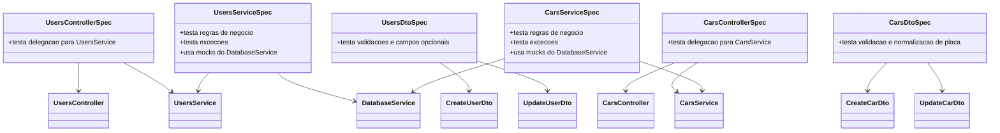
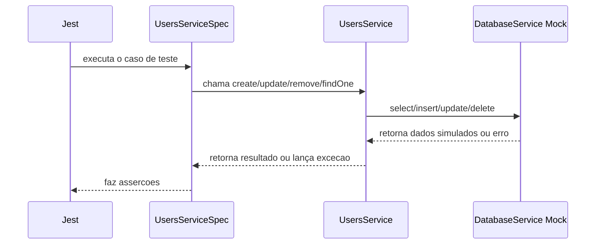

# CRUD simples com NestJS, Drizzle e PostgreSQL

Aplicação web simples para realizar CRUD de usuários e carros. O projeto usa NestJS no backend, Drizzle ORM para mapear as tabelas e PostgreSQL como banco de dados.

## Visão geral do projeto

Após os exercícios, a aplicação passou a trabalhar com dois domínios:

- `users`: armazena os usuários do sistema.
- `cars`: armazena os carros vinculados a um usuário.

O relacionamento entre as tabelas é de `1:N`: um usuário pode ter vários carros, e cada carro pertence obrigatoriamente a um único usuário.

Além do CRUD básico, o projeto também aplica regras de negócio:

- o campo `name` da tabela `users` é único;
- a placa do carro deve seguir o padrão Mercosul `AAA1A11`;
- um carro só pode ser cadastrado se o usuário informado existir;
- a aplicação impede a remoção de um usuário que ainda possui carros vinculados.

## Estrutura das tabelas

### Tabela `users`

```sql
CREATE TABLE users (
  id_user SERIAL NOT NULL PRIMARY KEY,
  name VARCHAR(100) NOT NULL UNIQUE,
  email VARCHAR(100)
);
```

### Tabela `cars`

```sql
CREATE TABLE cars (
  id_car SERIAL NOT NULL,
  id_user INTEGER NOT NULL,
  plate CHAR(7) NOT NULL,
  PRIMARY KEY(id_car),
  FOREIGN KEY(id_user)
    REFERENCES users(id_user)
);
```

## Como essa estrutura aparece no código

No projeto, as tabelas existem em duas camadas:

- no PostgreSQL, como tabelas físicas criadas com SQL;
- no código, como schemas do Drizzle ORM usados para montar consultas tipadas.

Isso significa que os arquivos de schema não criam as tabelas sozinhos. Eles apenas descrevem a estrutura que o NestJS vai usar para consultar, inserir, atualizar e remover dados.

Os schemas principais são:

- `src/users/users.schema.ts`
- `src/cars/cars.schema.ts`
- `src/database/schema.ts`

O arquivo `src/database/schema.ts` centraliza a exportação dos schemas para que o `DatabaseService` consiga inicializar o Drizzle com todas as tabelas do projeto.

## Organização em módulos no NestJS

O projeto está organizado seguindo a estrutura padrão do NestJS, separando responsabilidades por domínio.

### Módulo `users`

- `src/users/users.controller.ts`
  Recebe as requisições HTTP da API de usuários.

- `src/users/users.service.ts`
  Implementa as regras de negócio de usuários, incluindo a validação de nome único e a tentativa de remoção segura quando existir relacionamento com carros.

- `src/users/users.schema.ts`
  Define a estrutura da tabela `users` para o Drizzle ORM.

- `src/users/dto/create-user.dto.ts`
  Valida os dados de entrada para criação de usuários.

- `src/users/dto/update-user.dto.ts`
  Valida os dados de entrada para atualização de usuários.

- `src/users/users.module.ts`
  Agrupa controller e service do domínio de usuários.

### Módulo `cars`

- `src/cars/cars.controller.ts`
  Recebe as requisições HTTP da API de carros.

- `src/cars/cars.service.ts`
  Implementa o CRUD de carros, valida a existência do usuário associado e consulta os dados relacionados ao proprietário.

- `src/cars/cars.schema.ts`
  Define a estrutura da tabela `cars`, incluindo a chave estrangeira `id_user`.

- `src/cars/dto/create-car.dto.ts`
  Valida os dados de criação de carros, principalmente `idUser` e `plate`.

- `src/cars/dto/update-car.dto.ts`
  Valida os dados de atualização de carros.

- `src/cars/cars.module.ts`
  Agrupa controller e service do domínio de carros.

### Camada de banco e inicialização

- `src/database/database.service.ts`
  Cria a conexão com o PostgreSQL e expõe a instância `db` do Drizzle.

- `src/database/database.module.ts`
  Torna o acesso ao banco disponível para os módulos da aplicação.

- `src/app.module.ts`
  Registra os módulos principais da aplicação.

- `src/main.ts`
  Inicializa o NestJS e aplica o `ValidationPipe` global.

## Como funcionam as validações

As validações da aplicação ficam concentradas nos DTOs, usando `class-validator`, e são executadas automaticamente pelo `ValidationPipe` configurado em `src/main.ts`.

### Validações de `users`

- `name` é obrigatório;
- `name` deve respeitar os limites definidos no DTO;
- `email`, quando informado, deve ter formato válido;
- a duplicidade de `name` é validada no service antes do `insert` e do `update`.

### Validações de `cars`

- `idUser` deve ser um número inteiro válido;
- `plate` deve seguir o padrão Mercosul `AAA1A11`;
- a placa é normalizada para maiúsculas antes da validação;
- se a placa for inválida, o NestJS retorna erro `400 Bad Request`;
- se o usuário informado não existir, o service retorna erro informando que o usuário não foi encontrado.

## Fluxo das requisições

O fluxo geral da aplicação segue a mesma ideia para os dois módulos:

1. o controller recebe a requisição HTTP;
2. o NestJS valida o corpo com o DTO correspondente;
3. o service aplica a regra de negócio;
4. o `DatabaseService` fornece acesso ao Drizzle;
5. o Drizzle executa a operação SQL no PostgreSQL.

### Exemplo: criação de usuário

1. `POST /api/users` chega ao `UsersController`;
2. o corpo é validado por `CreateUserDto`;
3. o `UsersService` verifica se o nome já existe;
4. se estiver tudo certo, o registro é inserido na tabela `users`.

### Exemplo: criação de carro

1. `POST /api/cars` chega ao `CarsController`;
2. o corpo é validado por `CreateCarDto`;
3. o DTO verifica se a placa segue o padrão Mercosul;
4. o `CarsService` confirma se o `id_user` existe;
5. o carro é inserido na tabela `cars`.

## Relação entre `users` e `cars`

O relacionamento entre as tabelas afeta diretamente o comportamento da aplicação:

- para cadastrar um carro, é obrigatório informar um usuário existente;
- ao listar carros, a aplicação pode consultar também o nome do usuário relacionado;
- ao tentar remover um usuário com carros vinculados, o banco impede a exclusão por causa da chave estrangeira, e a aplicação converte isso em uma mensagem de erro apropriada.

## Requisitos

- Node.js
- npm
- PostgreSQL

## Configuração

1. Instale as dependências:

```bash
npm install
```

2. Crie ou ajuste o arquivo `.env` na raiz do projeto:

```env
PORT=3000

DB_HOST=localhost
DB_PORT=5432
DB_USER=postgres
DB_PASSWORD=123
DB_NAME=bdaula
```

3. Crie a tabela no PostgreSQL:

```sql
CREATE TABLE users (
  id_user SERIAL NOT NULL PRIMARY KEY,
  name VARCHAR(100) NOT NULL UNIQUE,
  email VARCHAR(100)
);

CREATE TABLE cars (
  id_car SERIAL NOT NULL,
  id_user INTEGER NOT NULL,
  plate CHAR(7) NOT NULL,
  PRIMARY KEY(id_car),
  FOREIGN KEY(id_user)
    REFERENCES users(id_user)
);
```

## Execução

```bash
npm run dev
```

Abra no navegador:

```text
http://localhost:3003
```

## Testes unitários

O projeto possui testes unitários para controllers, services e DTOs dos módulos `users` e `cars`.

Os testes foram escritos para validar comportamento de negócio sem depender de um PostgreSQL real. Por isso, os services usam mocks do `DatabaseService` e as validações dos DTOs são executadas diretamente com `class-validator`.

### Estrutura dos testes

Os arquivos atuais de teste são:

- `src/users/users.controller.spec.ts`
- `src/users/users.service.spec.ts`
- `src/users/users.dto.spec.ts`
- `src/cars/cars.controller.spec.ts`
- `src/cars/cars.service.spec.ts`
- `src/cars/cars.dto.spec.ts`

### O que está sendo testado

#### `users`

- delegação correta do `UsersController` para o `UsersService`;
- criação de usuário com nome único;
- tratamento de erro de duplicidade de nome;
- busca de usuário inexistente;
- atualização de e-mail com conversão de string vazia para `null`;
- tentativa de remoção de usuário com carros vinculados;
- validações dos DTOs de criação e atualização.

#### `cars`

- delegação correta do `CarsController` para o `CarsService`;
- criação de carro vinculada a um usuário existente;
- bloqueio de criação quando o usuário não existe;
- busca de carro inexistente;
- atualização preservando os dados atuais quando o DTO é parcial;
- remoção de carro inexistente;
- validação e normalização da placa Mercosul nos DTOs.

### Como os testes funcionam

#### Testes de controller

Os controllers são testados como unidade isolada. O service é substituído por um mock e o teste verifica se cada método do controller repassa corretamente os parâmetros recebidos.

#### Testes de service

Os services são testados sem banco real. Em vez de abrir conexão com PostgreSQL, o teste injeta um objeto com mocks para os métodos usados pelo Drizzle:

- `select`
- `insert`
- `update`
- `delete`

Isso permite validar apenas a regra de negócio:

- exceções lançadas;
- chamadas feitas ao banco;
- dados enviados para inserção e atualização;
- tratamento de erros do PostgreSQL, como `23505` e `23503`.

#### Testes de DTO

Os DTOs são convertidos com `plainToInstance` e validados com `validate`. Assim, os testes garantem:

- mensagens de validação esperadas;
- aceitação de campos opcionais;
- transformação da placa para maiúsculas antes da validação.

### Diagrama UML da estratégia de testes



### Diagrama UML do fluxo de execução de um teste de service



### Como executar

Para executar toda a suíte unitária:

```bash
npm test
```

Para executar em modo watch durante o desenvolvimento:

```bash
npm run test:watch
```

Para gerar o relatório de cobertura:

```bash
npm run test:cov
```

### Como interpretar a cobertura

Ao rodar `npm run test:cov`, o Jest gera:

- resumo no terminal com percentuais por arquivo;
- pasta `coverage/` com o relatório HTML.

Os indicadores principais são:

- `Statements`: percentual de instruções executadas;
- `Branches`: percentual de decisões cobertas, como `if` e operadores condicionais;
- `Functions`: percentual de funções chamadas pelos testes;
- `Lines`: percentual de linhas executadas.

### O que não é objetivo desta suíte

Estes testes não verificam integração real com PostgreSQL, rotas HTTP completas nem bootstrap da aplicação. Esse tipo de verificação entraria em testes de integração ou testes `e2e`, normalmente mantidos em uma pasta como `test/`.

## Rotas da API

- `GET /api/users`
- `GET /api/users/:id`
- `POST /api/users`
- `PUT /api/users/:id`
- `DELETE /api/users/:id`
- `GET /api/cars`
- `GET /api/cars/:id`
- `POST /api/cars`
- `PUT /api/cars/:id`
- `DELETE /api/cars/:id`
